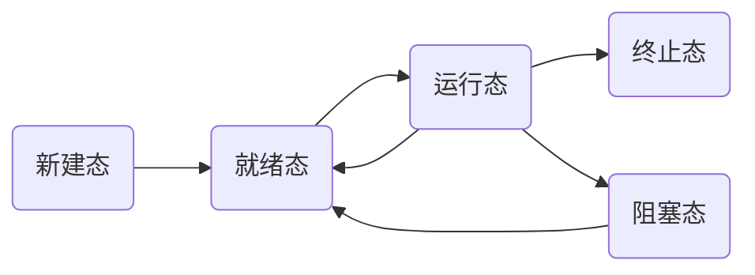

# Operating Systems

## 前言

#### 程序向操作系统迈进

* 预处理阶段
* 编译阶段
* 汇编阶段
* 链接阶段

## 多任务管理

### 引言

* 多任务管理: 在不同的进程中交替执行

* **并发**: 一个 **CPU** 交替执行 
* PC 寄存器 : 取指执行的指针
* 运行的程序: 进程
* 为了提高 CPU 的利用率 , 更好的管理 CPU

### 多进程的组织: PCB + 状态 + 队列

#### 状态

* 运行 -> 等待
* 运行 -> 就绪
* 就绪 -> 运行

##### 图形



## 多进程图像

### 多进程图像

* PID = 1
* PID = 2
* PID = 3

### 多继承源码

```C
//fork(); //创建进程
//如果是父进程,则返回子进程的PID
//如果是子进程,则返回0
if(!fork())
{
    init();
}
```

#### PCB ( Process Control Block)

* 记录进程信息的数据结构
* 切换进程时记录原先进程的寄存器的数据, 以便切换回来

#### 进程调度

* 队列操作 + 调度 + 切换

#### 多个进程同时操作相同地址的内存

* 映射表: 不同进程将相同的**地址**通过「**映射表**」映射到不同的**物理内存**上

#### 合理的推进顺序

* 给一些变量上锁( Lock )


## 用户级线程

### 线程的由来

* 线程  = 资源 + 指令执行序列
* 将 **资源** 和 **指令 **分开
* 一个**资源** + 多个**指令**[ **线程** ]

### 线程

* 保留了并发的优点
* 本质: **映射表**不变而**PC指针**改变
* 多个线程共享内存资源( 映射表不变 )

### Creat && Yield

#### Yield 核心

* 进行切换线程

* 运用了两个栈
* 两个线程的样子
  1. 两个 TCB ( 指向栈的指针 )[ 全局 ]
  2. 两个栈
  3. 切换的 PC 在栈中

#### Creat 核心

* 作用: 初始化第一次切换线程时应该的样子

```C
void TreadCreat(A)
{
    TCB * tcb = malloc ();
    *stack = malloc;//申请一段内存作为栈
    *stack = A ;//A 为函数 
    tcb.esp = stack;//栈和tcb关联
}
```

## 内核级线程

### 和用户级相比，核心级线程有什么不同？

#### ThreadCreate是系统调用，内核管理TCB,内核负责切换线程

##### 如何让切换成型？-内核栈，TCB

* 用户栈是否还要用？执行的代码仍然在用户态，还要进行函数调用
* 一个栈到套栈：两个栈到两套栈


## CPU 调度策略

### 协调问题

#### 一些指标

* 周转时间: 任务进入到任务结束的时间
* 响应时间: 从操作发生到响应的时间
* 系统内耗: 切换进程时, 需要的时间, 如:TCB, 映射表

#### 合理协调

##### 吞吐量和响应时间之间有矛盾

* 响应时间小→切换次数多→系统内耗大→吞吐量小

##### 前台任务和后台任务的关注点不同

* 前合任务关注响应时间
* 后台任务关注周转时间

### CPU 各种调度算法

#### First Come,First Served (FCFS)

* 先来先服务
* 不足: 
  * 不能让运行时间短的进程先进行
  * 让短的进程先进行可以, 可以减少运行的进程数量, 从而减少周转速度, 进而减少系统内耗

#### SJF:短作业优先

* 让运行时间短的进程先进行
* 使得周转时间减少

#### RR:按时间片来轮转调度

* 每个进程都能运行一点
* 使得响应时间变快
* 时间片大：响应时间太长；时间片小：吞吐量小

#### 响应时间和周转时间同时存在，怎么办？

* 直观想法：定义前台任务和后台任务两队列，前台RR,后台SJF,只有前台任务没有时才调度后台任务

## 内存管理